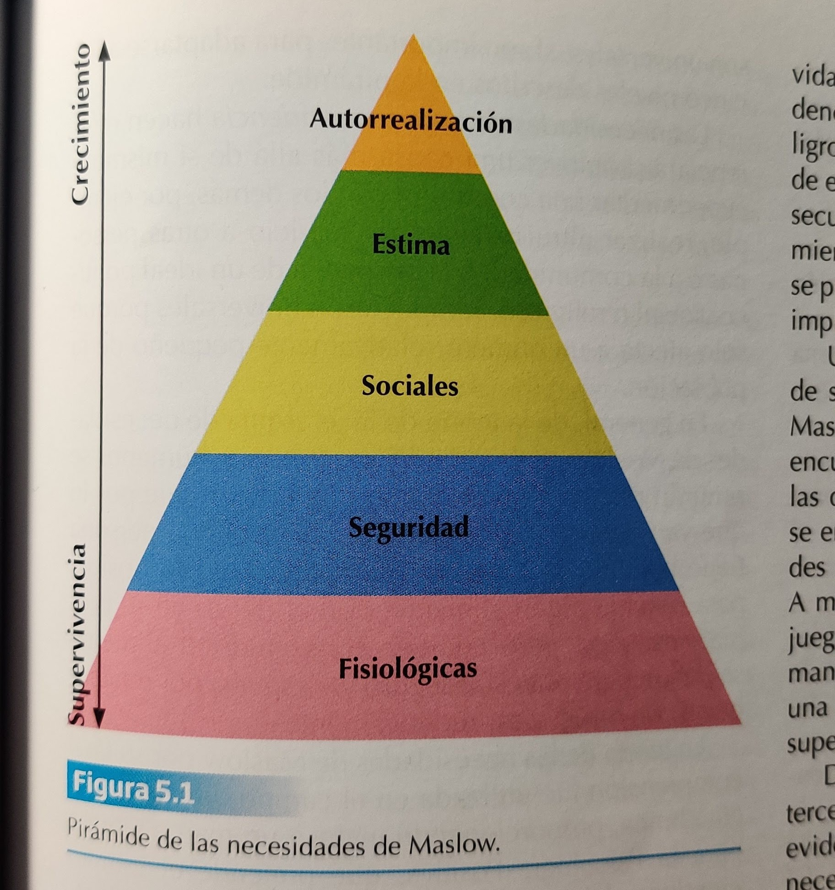

# TEMA 5 - LOS MOTIVOS ADQUIRIDOS

Table of Contents
=================

   * [TEMA 5 - LOS MOTIVOS ADQUIRIDOS](#tema-5---los-motivos-adquiridos)
   * [1. Introducción](#1-introducción)
   * [2. Los motivos o necesidades adquiridas](#2-los-motivos-o-necesidades-adquiridas)
   * [3. Teorías sobre las necesidades](#3-teorías-sobre-las-necesidades)
      * [3.1. La pirámide de las necesidades de Maslow](#31-la-pirámide-de-las-necesidades-de-maslow)
      * [3.2. La jerarquía de Alderfer](#32-la-jerarquía-de-alderfer)
      * [3.3. Las tres necesidades dominantes según McClelland](#33-las-tres-necesidades-dominantes-según-mcclelland)
   * [4. Motivo de logro](#4-motivo-de-logro)
      * [4.1. Concepto y definición del motivo de logro](#41-concepto-y-definición-del-motivo-de-logro)
      * [4.2. Primeros estudios sobre el motivo de logro](#42-primeros-estudios-sobre-el-motivo-de-logro)
      * [4.3. La conducta desencadenada por el motivo de logro](#43-la-conducta-desencadenada-por-el-motivo-de-logro)
      * [4.4. La adquisición y desarrollo del motivo de logro](#44-la-adquisición-y-desarrollo-del-motivo-de-logro)
      * [4.5. Estilos de motivo de logro](#45-estilos-de-motivo-de-logro)
      * [4.6. Motivo de logro y personalidad](#46-motivo-de-logro-y-personalidad)
   * [5. Motivo de afiliación e intimidad](#5-motivo-de-afiliación-e-intimidad)
      * [5.1. Concepto y definición del motivo de afiliación e intimidad](#51-concepto-y-definición-del-motivo-de-afiliación-e-intimidad)
      * [5.2. Las conductas desencadenadas por el motivo de afiliación y el motivo de intimidad](#52-las-conductas-desencadenadas-por-el-motivo-de-afiliación-y-el-motivo-de-intimidad)
      * [5.3. La adquisición y desarrollo del motivo de afiliación](#53-la-adquisición-y-desarrollo-del-motivo-de-afiliación)
   * [6. Motivo de poder](#6-motivo-de-poder)
      * [6.1. Concepto y definición del motivo de poder](#61-concepto-y-definición-del-motivo-de-poder)
      * [6.2. La conducta desencadenada por el motivo de poder](#62-la-conducta-desencadenada-por-el-motivo-de-poder)
      * [6.3. La adquisición y desarrollo del motivo de poder](#63-la-adquisición-y-desarrollo-del-motivo-de-poder)
      * [6.4. Motivo de poder y liderazgo](#64-motivo-de-poder-y-liderazgo)
      * [6.5. Motivo de poder y conducta de agresión](#65-motivo-de-poder-y-conducta-de-agresión)
   * [7. Motivo de autorrealización](#7-motivo-de-autorrealización)

# 1. Introducción
Con el estudio de los motivos humanos se demuestra que existe una evidente diferencia entre unos motivos innatos (cubren necesidades biológicas y fisiológicas) y otros adquiridos (cubren necesidades aprendidas).

En este tema nos centraremos en los segundos: motivaciones que están relacionadas con el crecimiento potencial de los seres humanos. Encontramos su origen en el carácter social del ser humano, en la necesidad de agruparse y estar unido a otras personas, por eso también se denominan _Motivos sociales_. Encuentran su verdadera justificación expresándose en relación con los demás.

Hay muchos motivos adquiridos posibles, pero solo tres de ellos tienen respaldo científico suficiente para considerarse importantes: el motivo de logro, el motivo de poder y el motivo de afiliación. 

# 2. Los motivos o necesidades adquiridas
En el ser humano, la motivación tiene una relevancia extra: no solo garantizar la supervivencia (como en otras especies), sino también el **desarrollo psicológico: superarse a sí mismos, competir con los demás... autorrealización y crecimiento potencial**. 

El desarrollo del ser humano surge de la combinación de tres niveles:
- **Nivel biológico**: los órganos llevan a cabo funciones que ayudan a preservar el equilibrio del cuerpo
- **Nivel psicológico**: responder a influencias que ayudan al organismo a desenvolverse en su medio. Establecimiento de relaciones entre los objetos del medio y las necesidades, lo que supone una actividad cognitiva. 
- **Nivel social**: el ser humano asimila la conciencia social y la cultura de la sociedad, surgen las necesidades individuales de la persona humana (autorrealización, autovaloración, empatía, bienes materiales...). Se corresponde con necesidades sociales como sentido del deber, dedicación al trabajo, amor a los demás...

Los niveles biológico y psicológico son comunes entre humanos y animales. El social es exclusivo del ser humano. 

Aunque sean autónomos, se relacionan indirectamente e influyen entre sí: procesos psicológicos y biológicos influyen en los sociales.

La motivación humana es principalmente social, puesto que el ser humano ha adquirido y asimilado una conciencia social.

# 3. Teorías sobre las necesidades
Existen muchas teorías más, pero estas son las que los autores consideran más relevantes

## 3.1. La pirámide de las necesidades de Maslow
Introducida por Abraham Maslow en 1943, en _Teoría de la Motivación Humana_. 5 niveles, divididos en dos categorías:

- **Necesidades de orden inferior**:
  - **Fisiológicas**: satisfacer las necesidades relacionadas con la supervivencia: comer, beber, dormir, etc. 
  - **De seguridad**: aspectos que garantizan la vida y la tendencia a la conservación frente al peligro: protección, estabilidad familiar/laboral, salud. Se pretende encontrar la necesidad de estabilidad
- **Necesidades de orden superior**:
  - **Sociales**: satisfacer la parte social del ser humano: relacionarse con los demás, ser parte de un grupo, sentirse integrado y querido por él (ejemplos: casarse, tener una familia, tener una religión, ser parte de un club social...)
  - **Estima**: (también conocidas como necesidades del ego o de autoestima). Dos consideraciones: **factores internos** (respeto a uno mismo y los demás, autovaloración y deseo de logro... en general, la valoración que uno tiene de sí mismo) y **factores externos** (sentirse apreciado, ser reconocido, tener prestigio... en general, la valoración que los demás tienen de uno mismo).
  - **Autorrealización**: trascender o desarrollar al máximo su talento o potencial personal.

En 1970 Maslow realizó una actualización y añadió tres necesidades nuevas:
- **Necesidades estéticas**: motivarse por belleza exterior y experiencias estéticas
- **Necesidades cognitivas**: deseo de ser curiosos y conocer lo que nos rodea
- **Necesidades de auto-trascendencia**: promover una causa más allá de sí mismo (e.g. voluntariado, búsqueda de un ideal político)

Un detalle importante es que los humanos **se sienten más motivados por lo que buscan que por lo que ya tienen**, siempre buscamos pasar al siguiente nivel en lugar de quedarnos en el que estamos.

**OJO**: la investigación científica no ha respladado la teoría de Maslow, no tiene ningún apoyo empírico. 

## 3.2. La jerarquía de Alderfer  
Remodelación de la teoría de Maslow. Agrupa las necesidades en 3 grupos: **existencia, relación y crecimiento, formando la teoría ERC**

- **Necesidades de Existencia**: requerimientos más básicos de supervivencia: comer, beber, dormir, tener seguridad propia y de la familia... Se corresponde con necesidades fisiológicas + de seguridad de Maslow
- **Necesidades de Relación**: el deseo que tenemos de mantener relaciones con los demás y el deseo que tenemos de tener estatus, ser reconocidos. Se corresponde con necesidades sociales + componente externo de necesidades de estima de Maslow
- **Necesidades de Crecimiento**: satisfacción del deseo intrínseco de desarrollo personal, aquellas capacidades que valoramos positivamente en nosotros mismos. Se corresponde con necesidades de autorrealización + componente interno de necesidades sociales de Maslow.

Además, **Alderfer se carga la pirámide: todas las necesidades pueden operar al mismo tiempo, no hay una jerarquía rígida entre ellas**.Además, **el orden no es el mismo para todos: dos personas distintas pueden tener distintas prioridades/valores y dedicarse a unas necesidades en vez de a otras**. En esto también influye la cultura, la familia, etc.

Presenta el **Principio de frustración-regresión: cuando no somos capaces de satisfacer una necesidad de orden superior** (e.g. crecimiento), **se centrará en mejorar aún más en mejorar otras de nivel inferior** (e.g. existencia), **en lugar de seguir luchando por una necesidad nueva**

La teoría ERC representa una visión más válida que la de Maslow (aunque tampoco está validada 100%)

## 3.3. Las tres necesidades dominantes según McClelland
McClelland señala que la motivación busca satisfacer tres necesidades dominantes: la de logro, la de afiliación y la de poder.

Todas las personas poseen las tres, aunque género, edad, cultura... pueden influir en cuál tiene más fuerza. **La satisfacción de un individuo dependerá de las tres necesidades dominantes, y del grado de intensidad que tiene cada una en su escala de valores**. Según sea esta, se motivará de una u otra manera y cambiará su necesidad de actuar. 

- **Necesidad de logro**: esfuerzo por sobresalir, por destacar, por conseguir éxito personal (superar las metas propias)
- **Necesidad de afiliación**: deseo de establecer relaciones de amistad y cercanía con los demás
- **Necesidad de poder**: necesidad de tener influencia, haciendo que los demás se comporten como uno desea, controlarlos.

En el sistema de McClelland todos los motivos dominantes son aprendidos y **con entrenamiento adecuado se podía modificar el perfil de una necesidad**

# 4. Motivo de logro
## 4.1. Concepto y definición del motivo de logro
## 4.2. Primeros estudios sobre el motivo de logro
## 4.3. La conducta desencadenada por el motivo de logro
## 4.4. La adquisición y desarrollo del motivo de logro
## 4.5. Estilos de motivo de logro
## 4.6. Motivo de logro y personalidad

# 5. Motivo de afiliación e intimidad
## 5.1. Concepto y definición del motivo de afiliación e intimidad
- **Motivo de afiliación**:
  - Palmero, 1997: **tendencia de los sujetos a asociarse con otros individuos, a buscar el contacto social frecuente y a formar grupos estables**
  - Reeve, 2010: **necesidad por establecer, mantener o restaurar una relación afectiva positiva con otras personas**. Con esto puede parecer que necesidad de afiliación == sociabilidad/extraversión, pero no. Se encuentra más relacionada con el temor al rechazo interpersonal y a la desaprobación. **Las personas con una alta necesidad de afiliación se perciben como "dependientes"**, no como cordiales o amistosas.
  - Dan McAdams, 1980: **necesidad de aprobación, aceptación y seguridad en las relaciones interpersonales**.

- **Motivo de intimidad**:
  - McAdams, 1980: **Disposición a experimentar un intercambio cálido, cercano y comunicativo con otra persona**. Implica poco miedo al rechazo, **se preocupa por la calidad de las relaciones**.
  - McAdams, 1989: **Características: compromiso e interés por las relaciones interpersonales sin que implique deber u obligación, o necesidad de restitución**. Personas más cálidas y afectuosas, más proclives a fomentar la amistad

En resumen:
- Intimidad --> parte positiva - Participar en relaciones cálidas y cercanas
- Afiliación --> parte negativa - Necesidad ansiosa por las relaciones

## 5.2. Las conductas desencadenadas por el motivo de afiliación y el motivo de intimidad
- **Motivo de afiliación**:
  - **Principal característica**: privación de interacción social, se expresa como un motivo asociado a una deficiencia. Evita las situaciones de soledad, rechazo, separación
  - Personas con elevado motivo de afiliación intentan interactuar lo máximo posible con los demás, esforzándose por evitar conflictos y situaciones competitivas. Experimentan altos niveles de ansiedad al ser evaluados por temor a ser rechazados. 
- **Motivo de intimidad**:
  - **Principal característica**: necesidad de interacción social que surge a partir del afecto y calidez. Motivo orientado al crecimiento potencial
  - Las personas con un elevado motivo de intimidad satisfacen su necesidad a través de cercanía y calidez en una relación. Encuentran satisfacción al escuchar, observan, ríen y sonríen más durante interacciones. 

## 5.3. La adquisición y desarrollo del motivo de afiliación
Se adquiere desde el nacimiento, con la relación entre el recién nacido y sus padres

Durante infancia, se desarrolla. Surgen relaciones con otros niños que incrementan la necesidad. 

En la adolescencia la necesidad de afiliación con sus iguales es necesaria para el desarrollo, sirve de apoyo emocional y favorece pertenencia a grupo. Se va perdiendo a medida que el individuo desarrolla su identidad personal.

En resumen: **es una de las variables imprescindibles para entender cómo se constituyen los grupos sociales y para comprender por qué alguien relega una necesidad individual por una del grupo** (puesto que así también satisface en parte una necesidad individual, la de afiliación)

# 6. Motivo de poder
## 6.1. Concepto y definición del motivo de poder
## 6.2. La conducta desencadenada por el motivo de poder
## 6.3. La adquisición y desarrollo del motivo de poder
## 6.4. Motivo de poder y liderazgo
## 6.5. Motivo de poder y conducta de agresión
# 7. Motivo de autorrealización
