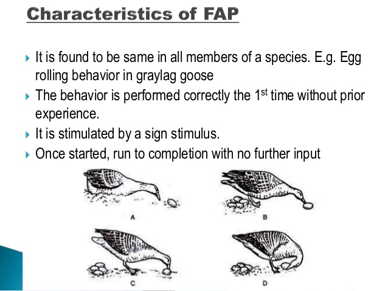

# Tema 6 - Motivación y conducta adaptativa

Table of Contents
=================

   * [Tema 6 - Motivación y conducta adaptativa](#tema-6---motivación-y-conducta-adaptativa)
   * [1. Introducción](#1-introducción)
   * [2. Explicación de la motivación desde la biología](#2-explicación-de-la-motivación-desde-la-biología)
      * [2.1. Impacto del evolucionismo](#21-impacto-del-evolucionismo)
      * [2.2. Enfoque etológico](#22-enfoque-etológico)
   * [3. La conducta motivada humana](#3-la-conducta-motivada-humana)
      * [3.1. Del instinto al motivo](#31-del-instinto-al-motivo)
      * [3.2. La pulsión en el psicoanálisis](#32-la-pulsión-en-el-psicoanálisis)
      * [3.3. La reacción del movimiento conductista](#33-la-reacción-del-movimiento-conductista)
   * [4. La motivación en la base de la conducta aprendida](#4-la-motivación-en-la-base-de-la-conducta-aprendida)
      * [4.1. Factores motivacionales en el condicionamiento clásico](#41-factores-motivacionales-en-el-condicionamiento-clásico)
      * [4.2. La motivación en el modelo E-R](#42-la-motivación-en-el-modelo-e-r)
      * [4.3. La motivación como función activadora](#43-la-motivación-como-función-activadora)
      * [4.4. La motivación como función informativa](#44-la-motivación-como-función-informativa)
   * [5. La devaluación del reforzador](#5-la-devaluación-del-reforzador)

# 1. Introducción
A lo largo de este bloque, estudiaremos la vinculación de la motivación con otros procesos cognitivos como el aprendizaje y el pensamiento

Hasta ahora nos hemos centrado mucho en la motivación como proceso energizador de las conductas que aseguran la supervivencia. Pero a medida que ascendemos en la escala evolutiva vemos que las conductas aprendidas van adquiriendo más importancia que las conductas innatas, por lo que el aprendizaje juega un papel muy importante. No obstante, también es cierto qque la motivación es muy responsable de lo que se aprende y se ejecuta: ambos procesos están muy relacionados. **Motivación como determinante para adquisición de comportamientos:** aprendemos conductas que nos han dado satisfacción o buenos resultados, nos motiva experimentar esa satisfacción de nuevo

# 2. Explicación de la motivación desde la biología
## 2.1. Impacto del evolucionismo
Antiguamente, predominaba el **fijismo: los seres humanos que poblaban el mundo fueron siempre los mismos, igual que los animales y los vegetales. El hombre estaba por encima de todo porque tenía alma. Todo surgió de la Creación que hizo Dios. Sólo así se explicaba la perfección de todas las especies**

En el siglo XVIII empieza a defenderse la evolución, el origen no-divino de los seres vivos. Algunos lo consideran una revolución parecida a la copernicana (el Sol, y no Dios, es el centro del universo) en cuanto al impacto que tuvo.

### 2.1.1. La herencia de los caracteres adquiridos
Lamarck (1744-1829). Principales características de su teoría:

- **Principio de perfección**: cada especie posee un impulso innato de perfeccionarse a sí misma
- **Cambios en el entorno provocan modificación de las necesidades, y a su vez una adaptación en los sujetos**: ejemplo de los cuellos de las jirafas para llegar a los árboles más altos.
- **Principio del uso y el desuso**: los miembros más usados contribuyen más a la adaptación y los menos usados se atrofian por el desuso
- **Herencia de carácteres adquiridos**: las características se transmiten a los descendientes, ayudando a que ellos también se adapten mejor al medio

**RELACIÓN DE LA TEORÍA DE LAMARCK CON LA MOTIVACIÓN:** cuando el medio cambiaba, los seres tenían que adaptar sus conductas para seguir saciando sus necesidades. Círculo cerrado de hábitos: la conducta empieza como involuntaria, y de tanto repetirla se convierte en habitual y después en instinto. Este instinto se hereda. Por tanto, **motivación para adquirir nuevas conductas --> clave para sobrevivir --> resultado: evolución**

(Después se demostró que el lamarckismo era una teoría incorrecta, pero ya empezaba a aparecer la motivación como desencadenante de la evolución)

### 2.1.2. La selección natural
Darwin (1809 - 1882). Claves:
- **Existe una continuidad en las formas de vida** desde la más baja a la más elevada
- **La adaptación al medio es necesaria para sobrevivir**

Desmiente a Lamarck: **la evolución se explica porque aparecen individuos que se adaptan mejor. La necesidad no crea el órgano**

**El hombre no es un privilegiado, es un eslabón más en la cadena de la evolución**

Resumen:

- **La vida es esencialmente adaptación y lucha por la supervivencia:** hay exceso de población en relación a la cantidad de recursos
- **Por azar, aparecen variaciones en los sujetos**
- **En la lucha por la supervivencia, si las variaciones son positivas, aumentarán la probabilidad del individuo de sobrevivir (ser seleccionado de forma natural)**

Contribución a la psicología:
- **Descubre los mecanismos de adaptación del organismo al ambiente**
- **Establece la utilidad de motivación, inteligencia, aprendizaje, etc en dicha adaptación**
- **La conducta motivada obedece a necesidades del organismo (supervivencia) y pasa a ocupar un lugar central (como pulsión)**

### 2.1.3. Teorías evolucionistas en la actualidad
- La selección natural puede tener efectos radicales incluso a corto plazo (Grant y Grant, 1989, 2002; Weiner, 1994; Huey, 2000; Rundle, 2000). Se pasa de considerar la evolución como un cambio gradual y lento a explicarlo por cambios bruscos y rápidos.
- Explicación de los mecanismos de cambio evolutivo. No es sólo aislamiento geográfico, sino también señales adquiridas para reconocer a la pareja adecuada (Higgins, 2000)
- Se piensa que algunas conductas motivadas podrían estar genéticamente establecidas (aquellas que tuvieron especial utilidad para la supervivencia)

## 2.2. Enfoque etológico
**Etología**: la parte de la biología que estudia el comportamiento animal, principalmente a través de estudios de campo (_ethos == costumbre_)

**Dos conceptos clave** sobre los mecanismos de adaptación de la conducta:
- **Filogenia**: cambios conductuales de una especie a lo largo de su evolución
- **Ontogenia**: cambios conductuales de un organismo a lo largo de su vida

Los cambios filogenéticos hacen que la especie esté más adaptada, más evolucionada; los cambios ontogénicos hacen que unos individuos se adapten mejor que otros.

Forma de saber si una conducta es innata o aprendida: se aisla totalmente al sujeto desde su nacimiento, y aun así desarrolla la conducta, es que es genética (ejemplo: el cantar de un pájaro). **Se empieza a definir el instinto por el origen del patrón de comportamiento** (Lorenz)

Tres tipos de comportamiento: **innato** (se desarrollan automáticamente desde el nacimiento), **aprendido** (tocar el piano, aprender un idioma...) y **madurado** (innato pero no surge al nacer, necesita tiempo/desarrollo).

### 2.2.1. El patrón de acción modal
Se define el instinto como **pauta heredada de comportamiento complejo, común a la especie y con finalidad adaptativa**. 

El instinto es en parte genético (las conductas motivadas como beber, comer, dormir, etc responden a motivos homeostáticos, y los circuitos que activan eso tienen que estar en nuestros genes). Pero también es en parte aprendido (tenemos tendencia a reproducir comportamientos que vemos en los demás). 

Para reflejar esto, empezamos a denominar al instinto como **patrón de acción modal** (Baerends, 1988). **Hace hincapié en los aspectos modificables de la conducta, esta no es totalmente rígida aunque sea innata**.

**Características fundamentales del patrón de acción modal:**
- **Está presente en todos los miembros de la especie**
- **Cuando empieza, se realiza hasta el final**
- **Comportamiento estereotipado**: se repite sin variación pero con flexibiildad en su ejecución
- **El nivel mínimo de estimulación varía según las circunstancias**
- **El mismo estímulo produce efectos diferentes dependiendo del estado fisiológico del animal y sus acciones recientes**

Las conductas que surgen del patrón de acción modal están compuestas por tres elementos:
- **Estímulo índice**: Es lo que desencadena todo. Es un estímulo que el animal está programado genéticamente para responder. 
- **Mecanismo desencadenador**: el circuito fisiológico que activa la conducta
- **Conducta consumatoria**: la conducta que se realiza. Cuando más se asciende en la escala filogenética, menos determinada está por la genética y más por el aprendizaje (peces, anfibios, aves: muy genética; mamíferos: muy aprendizaje)

**Modelo de la energía**: para cada patrón de acción modal, el cuerpo acumula energía constantemente y poco a poco. Cuando aparece el estímulo índice, el mecanismo desencadenador la utiliza para activar la conducta consumatoria.

Pensar en ello como un circuito abierto que se está cargando, y de pronto el circuito se cierra y toda la energía fluye y e.g. enciende una bombilla.

**Acciones en vacío**: cuando se ha acumulado mucha energía, puede ejecutarse el comportamiento sin que haya estímulo índice _(ejemplo: un perro que entierra un hueso en el jardín aunque tenga comida; eso sólo tiene sentido si fuese un perro salvaje y la comida escasease)_ 

El patrón de acción modal es similar al reflejo, pero más complejo. Diferencias:
- El animal se encuentra motivado durante el patrón de acción modal, pero no durante el reflejo (que es automático)
- El patrón de acción modal no se puede condicionar
- El patrón de acción modal puede producirse de forma espontánea (acciones en vacío)

### 2.2.2. El troquelado
El troquelado o impronta es un fenómeno que consiste en que un individuo seguirá al primer individuo que vea al nacer. Lo descubrió por primera vez Konrad Lorenz (1935) al observar que los patitos que salieron de unos huevos que estaba incubando le seguían a todas partes y se agrupaban en torno a él en busca de protección

También se ha comprobado impronta con objetos inanimados (cajas de colores, muñecos de felpa...)

Existe un periodo de tiempo, conocido como **periodo crítico** para que la impronta ocurra. Una vez pasa el periodo crítico, es muy difícil que la impronta se produzca.

**Importancia adaptativa del troquelado: permite a una cría seguir a su madre y aprender conductas de ella. Esto garantiza el aprendizaje de conductas propias de la especie y facilita la protección materna** _(esto lo han preguntado muchas veces)_

Dos explicaciones a la conducta, unas basadas en aspectos aprendidos y otros en innatos
- Aprendidos: Aprendemos la conducta porque la figura de la madre (o de quien sea que nos improntemos) reduce el miedo, así que lo asociamos a algo bueno
- Innatos: Programación filogenética del impulso

Se han estudiado otros dos tipos de impronta:
- **Preferencia sexual**: hacia la especie de la que nos "improntamos"
- **Preferencia alimenticia**: hacia los alimentos a los que nos expongamos al principio de nuestra vida

# 3. La conducta motivada humana
## 3.1. Del instinto al motivo
Se empieza a investigar la conducta animal para hallar las bases del comportamiento humano. Se considera que el comportamiento humano no es totalmente voluntario, sino que es también instintivo porque venimos de los animales. **El instinto como fuerza motivacional pasa a formar parte de la conducta humana**

_(Esto lo preguntan bastante)_ William McDougall fue el defensor más acérrimo de los instintos: para él, desencadenaban la conducta y nos orientaban hacia una meta en particular. Los consideraba esfuerzos intencionales / pulsiones, más que una fuerza mecánica. El instinto regulaba la parte objetiva (la conducta, que podemos observar) pero también la parte subjetiva (los deseos, que no podemos observar). Suponía que todos los deseos brotaban de los instintos, así que la parte emocional del instinto era importante también

Hoy en día sabemos que muchas partes de sus suposiciones eran incorrectas, pero sentó las bases para que siguiéramos investigando sobre el instinto y llegáramos a lo que sí es cierto.

## 3.2. La pulsión en el psicoanálisis
Para Freud, existen tres aspectos estructurales:
- **Yo (ego)**: el consciente
- **Ello (id)**: el inconsciente. Incluye los impulsos que pueden ser biológicos (hambre), sociales (enfado) o sexuales.
- **Superyo (superego)**: la interiorización inconsciente de las normas sociales, familiares, etc. Es decir, cosas aprendidas por medio de nuestros grupos o sociedad

La fuerza que motiva la conducta surge del conflicto entre los impulsos del ello y la conciencia del yo

**Pulsión**: ocupa un papel central, entiende que el propósito del comportamiento era satisfacer necesidades corporales. La pulsión era lo ue motivaba la conducta, lo que incitaba el comportamiento**

Freud distinguía cuatro momentos en la pulsión:
- **Fuente**: el déficit corporal que desencadena la conducta
- **Esfuerzo**: la pulsión en sí. El "algo" que nos empuja a solucionar el déficit de la fuente. Su intensidad depende de nuestra necesidad
- **Meta**: el propósito que nos permite acabar con la tensión
- **Objetivo**: cualquier persona o cosa que sirve para satisfacer la pulsión.

Freud las dividió en dos grupos:
- **Pulsiones de vida**: las que aseguran la supervivencia y la vida (hambre, sed, sexo...)
- **Pulsiones de muerte**: las que incluyen impulsos destructivos o negativos (agresividad)

**_(Para entender un poco mejor todo, podríamos decir que podemos sustituir "pulsión" por "esfuerzo". Es más genérico pero es una forma más sencilla de entender el texto)_**

En resumen, **el psicoanálisis radica en poner en primer plano las motivaciones inconscientes como determinantes psíquicos fundamentales**

## 3.3. La reacción del movimiento conductista
El conductismo surgió un poco como reacción al psicoanálisis. Quería centrarse únicamente en aquello que podemos observar, que es objetivo (el comportamiento), y no en la conciencia o el pensamiento. Se centró mucho en términos de Estímulo-Respuesta

Su fundador, **John Broadus Watson**, defendió que cualquier conducta compleja se podía descomponer en reflejos, aprendidos en base a una historia de premios y castigos. 

# 4. La motivación en la base de la conducta aprendida
Clara relación entre motivación y aprendizaje: aprendemos más cuando estamos motivados.

## 4.1. Factores motivacionales en el condicionamiento clásico
El caso más claro es el del experimento del perro de Pavlov: un perro hambriento no empezaba a salivar cuando comía, sino cuando preveía que iba a comer (cuando veía llegar la comida, o cuando oía la campana que Pavlov tocaba para avisarle de que la comida estaba lista)

_(Es importante para esto entender el experimento del perro de Pavlov, se puede leer mucho sobre él en Internet: básicamente, confirmó que el perro asoció "sonido de campana" con "comida", así que cuando se daba "sonido de campana" el perro empezaba las reacciones de comer (como salivar) aunque no hubiese comida)_

Hasta este momento se creía que los reflejos eran automáticos e innatos, pero Pavlov demostró que se pueden aprender. Al mismo tiempo, también demostró que podíamos alterar la frecuencia y dirección de la conducta, a base de provocar los estímulos que la desencadenan.

Dos tipos de condicionamiento:
- **Apetitivo**: el que demostró Pavlov, porque el estímulo anticipa una respuesta agradable
- **De defensa**: demostrado por Bekhterev, cuando rechazamos el estímulo. _Ejemplo: si siempre chasqueamos los dedos antes de dar un golpe a alguien, en un momento determinado el chasqueo de dedos provocará una reacción de miedo en esa persona_

### 4.1.1. Componentes y proceso

### 4.1.2. Propiedades físicas del estímulo condicionado

### 4.1.3. Propiedades motivacionales del estímulo condicionado

## 4.2. La motivación en el modelo E-R
## 4.3. La motivación como función activadora
## 4.4. La motivación como función informativa
# 5. La devaluación del reforzador
