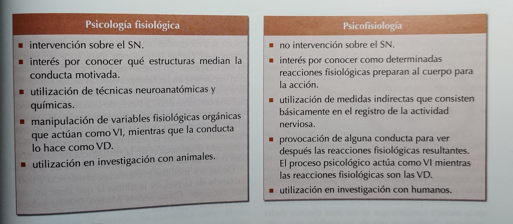
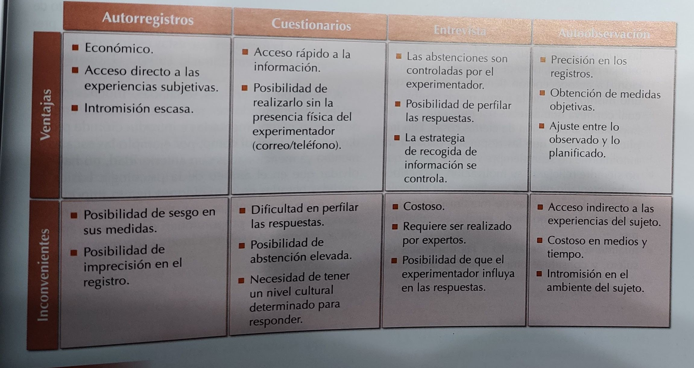

# Tema 9 - Técnicas de medida de la psicología de la motivación

Table of Contents
=================

   * [Tema 9 - Técnicas de medida de la psicología de la motivación](#tema-9---técnicas-de-medida-de-la-psicología-de-la-motivación)
   * [1. Introducción](#1-introducción)
   * [2. Técnicas de medida de la motivación](#2-técnicas-de-medida-de-la-motivación)
      * [2.1. Técnicas basadas en la medición de la conducta instrumental, manifiesta u observable](#21-técnicas-basadas-en-la-medición-de-la-conducta-instrumental-manifiesta-u-observable)
      * [2.2. Técnicas basadas en la medición de respuestas fisiológicas](#22-técnicas-basadas-en-la-medición-de-respuestas-fisiológicas)
      * [2.3. Técnicas basadas en la medición de estados subjetivos y sentimientos](#23-técnicas-basadas-en-la-medición-de-estados-subjetivos-y-sentimientos)

# 1. Introducción
Disponer de métodos y técnicas válidas y fiables para medir la motivación siempre ha sido una preocupación de la Psicología de la Motivación. No solo se han buscado instrumentos de evaluación, sino también que arrojen siempre los mismos resultados con independencia de la persona que lo aplique.

# 2. Técnicas de medida de la motivación
La motivación puede abarcar diferentes niveles de análisis que podemos agrupar en cuatro categorías:

- Fisiológico
- Individual
- Social
- Filosófico

Cada una de estas categorías ha utilizado técnicas de investigación distintas, porque sus requisitos son diferentes. En general, las técnicas de medida se han agrupado en tres grandes bloques:

- Medición de **la conducta observable**
- Medición de **respuestas fisiológicas**
- Medición de **estados subjetivos y sentimientos**

## 2.1. Técnicas basadas en la medición de la conducta instrumental, manifiesta u observable
La mayoría surgen de la psicología del aprendizaje. **Presuponen que la motivación se puede inferir a partir de la conducta públicamente observable emitida por un sujeto**. _Ejemplos: un amigo que se apunta al gimnasio para ir en su tiempo libre, está motivado para ir al gimnasio. Otro amigo que en su tiempo libre va al teatro en lugar de a pasear, está motivado por el teatro_

Los parámetros de medida más destacables son:

- **Tasa de respuesta**: el número de veces que se produce una conducta en un periodo de tiempo determinado (i.e. frecuencia de la conducta) _(alguien que va al gym 5 veces por semana está más motivado que alguien que va 1)_
- **Número de aciertos y errores**: hace referencia a cuántas veces la conducta se produce correctamente/incorrectamente, o cómo de eficazmente se produce. Se infiere que esto está relacionado con la motivación y se asume que fatiga, dificultad de la tarea, actúan de forma neutra _(ejemplo: en un partido de fútbol, si un equipo está muy motivado es más probable que meta goles (aciertos) y que reciba pocos goles (errores)_
- **Acciones de libre elección**: ante varias opciones disponibles, se estudia por cuál opta el sujeto. Indica qué acción le motiva más _(ejemplo anterior del teatro en lugar de pasear)_
- **Tiempo de reacción (TR)**: tiempo entre que el sujeto recibe el estímulo hasta que inicia su respuesta. Si está más motivado, el TR será menor. Se puede ver afectada por intensidad, duración y modalidad del estímulo

Otras medidas que se han considerado útiles son:

- **Persistencia**: dos maneras de definirla 1) tiempo dedicado a la tarea 2) cantidad de veces que se insiste en su ejecución
- **Esfuerzo mostrado**: cantidad de esfuerzo que se dedica a la tarea, sobretodo si se ha elegido de manera voluntaria. No tiene por qué ser enfocado solo en una tarea, sino pensando en una meta _(ejemplo: en un futbolista no es solo el esfuerzo que dedica en el entrenamiento, sino si luego revisa grabaciones de partidos, estudia tácticas por su cuenta, etc)_

### 2.1.1. Valoración de las técnicas en cuanto a su utilización en investigación motivacional básica
Estas técnicas son utilizadas con frecuencia en investigación motivacional básica

No obstante, presentan algunas limitaciones:

- Los datos de TR presentan gran variabilidad. Esto puede deberse a variables situacionales o del sujeto (e.g. diferencias individuales)
- En algunos casos es difícil medir qué son aciertos y qué son errores. De hecho es habitual utilizar variables subjetivas en investigación de la motivación, por lo que no hay una respuesta exacta

Estas limitaciones intentan solventarse, por ejemplo:  
- Dando instrucciones claras al sujeto
- Haciendo ensayos de práctica

## 2.2. Técnicas basadas en la medición de respuestas fisiológicas
Dos grandes categorías:

(Matices: SN = Sistema Nervioso - VI/VD = Variable Independiente/Dependiente)

### 2.2.1. Técnicas psicofisiológicas de medida de la motivación: actividad electrodermal y medidas cardiovasculares
Distintos tipos según qué parte del Sistema Nervioso (SN) miden:

- Sistema Nervioso Central (SNC)
- Sistema Nervioso Autónomo (SNA)
- Sistema Nervioso Somático (SNS)

Aquí nos centraremos en el SNA. Existen de dos tipos

#### Actividad electrodermal
Es una de las medidas más utilizadas, porque es económica y de fácil manejo. **Mide la actividad eléctrica de la piel**: las glándulas sudoríparas son excitadas debido a estímulos psicológicos.

Se mide de dos formas:  
- **Medición exosomática:** se aplica a la piel una corriente y se analiza una de dos opciones  
  - **Resistencia de la piel**: si mantenemos la corriente fija
  - **Conductancia de la piel**: si mantenemos el voltaje fijo. Es la más utilizada porque es más fácil de interpretar, se ajusta mejor a una distribución normal y tiene una relación más estrecha con los fenómenos bioeléctricos de las glándulas sudoríparas
- **Medición endosomática:** se evalúa como un cambio de potencial en la piel. Se mide la diferencia entre un punto del cuerpo que se considera neutro y otro que consideramos activo (donde existirá variación eléctrica).

#### Medidas cardiovasculares
Se utilizan distinas medidas:  
- **Frecuencia cardiaca**: número de latidos por minuto. Se suele registrar con el ECG (electrocardiograma). En investigaciones se detecta la tasa cardíaca cuando el sujeto lleva a cabo una tarea.
- **Flujo sanguíneo**: cantidad de sangre que llega a los tejidos u órganos. Se usan transductores (habitualmente fotoeléctricos, utilizan la luz) que convierten el flujo sanguíneo en una señal eléctrica. **Medida muy poco utilizada**
- **Presión arterial**: la fuerza con la que la sangre se mueve por las arterias. Es variable, y hablamos de **presión diastólica en su punto más bajo** y **presión sistólica en su punto más alto**. Se mide de dos formas: oclusión y auscultación utilizando el esfigmómetro y un estetoscopio (obtiene presión diastólica y sistólica) y mediante técnicas automatizadas que permiten una lectura continua **y son consideradas más útiles en psicología de la motivación**

**Con motivación, se observa aumento de la frecuencia cardiaca, disminución del flujo sanguineo, aumento de la presión arterial (especialmente la sistólica)**

### 2.2.2. Valoración de las técnicas en cuanto a su utilización en investigación motivacional básica
Las medidas fisiológicas **son muy utilizadas, son muy útiles para detectar la actividad del SNA asociado a conductas motivadas**.

Existen algunas críticas:  
- Son medidas indirectas de la motivación
- También pueden verse afectadas por otras procesos (emocionales, atencionales...)
- Significado psicológico cuestionable: una misma medida puede tener interpetaciones distintas, no existe una interpretación fija

Se están intentando eliminar estas limitaciones.

## 2.3. Técnicas basadas en la medición de estados subjetivos y sentimientos
Se utilizan **autoinformes: informes en los que el sujeto evalúa su propia actividad** (preferencias, intenciones, metas...). **Suelen utilizarse cuando se quieren evaluar aspectos que no pueden conocerse ni manipularse directamente**. Existen de muchos tipos y formas (preguntas directas o indirectas, dando libertad o con posibles respuestas, sí/no o puntuación 1 a 5...)

Se han utilizado principalmente con tres finalidades:  
- **Identificar la estructura motivacional básica:**
- **Comprobar interacción sujeto-ambiente**: cómo motivaciones concretas varían con la situación
- **Relación de causalidad**: cómo un conjunto de variables varía conjuntamente para estudiar la relación entre ellas.

### 2.3.1. Valoración de las técnicas en cuanto a su utilización en investigación motivacional básica
Limitaciones:  
- **No válidos para indicar los estados internos**: distintas personas pueden usar diferentes nombres para un mismo estado interno
- **Deseabilidad social**: el deseo de causar buena impresión puede hacer que se responda lo que el investigador quiere oír, no la realidad
- **Influencia de cómo presentamos prueba**: orden de las preguntas, redacción, formato de respuesta... Todo esto afecta a las respuestas que recibiremos

Ventajas:  
- Las limitaciones se pueden suplir con pruebas complementarias y medidas de control interno
- Son técnicas rápidas
- Proporcionan información que, al menos, es aproximadamente acertada

