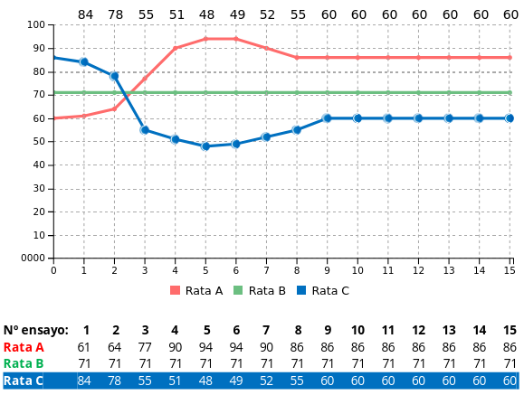
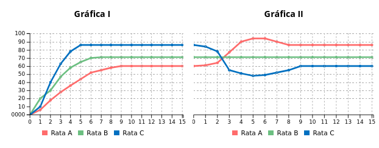
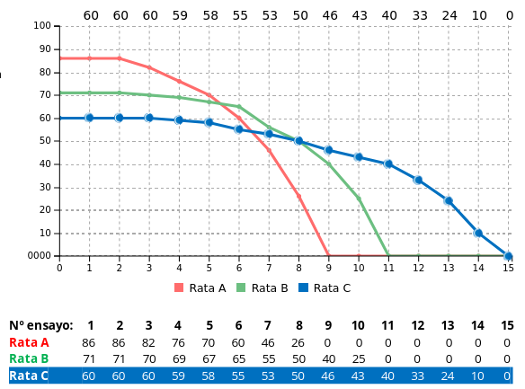

# Práctica 1 - Relación entre niveles de motivación y cantidad de premio

# Ejemplo experimental

## Descripción
- **Sujetos**: tres ratas de la misma edad y peso similar.
  - Se les racionó la comida antes de empezar el experimento.
  - Se redujo el peso de las ratas al 75% del peso normal para asegurar que tendrían hambre (y por tanto, estarían motivadas)
  - Se realizó _handing_ (los experimentadores cogían las ratas con las manos y las sujetaban durante un rato) para que las ratas se acostumbrasen al experimentador, y así durante el experimento la sorpresa fuese menor
- **Aparatos**: Corredor recto de 1.5m, con bolas de pienso como premio
- **Experimento**:
  - **1a fase**: se usa una cantidad distinta de alimento para motivar a cada rata. El premio que recibe una rata concreta no varía en toda la fase
  - **2a fase**: se cambia el premio: la rata que antes recibía más ahora recibe menos y viceversa.
  - **3a fase**: se elimina el premio totalmente

## Experimento

### 1a fase

- La rata A recibe 1 bolita de pienso (incentivo bajo)
- La rata B recibe 4 bolitas de pienso (incentivo medio)
- La rata C recibe 8 bolitas de pienso (incentivo alto)

Se realizan 15 ensayos. La rata más rápida fue siempre la C, la segunda la B, y la más lenta la A (relación inversa con el premio)

La velocidad de las ratas fue aumentando con cada experimento hasta que llegaron a un máximo (velocidad techo). A mayor incentivo, más pronto se alcanzaba este punto (C tras 5 ensayos, B tras 7, A tras 9)

### 2a fase

Ahora se cambia el incentivo

- La rata A ahora recibe 8 bolitas de pienso (incentivo alto)
- La rata B aún recibe 4 bolitas de pienso (incentivo medio)
- La rata C ahora recibe 1 bolita de pienso (incentivo bajo)

**Resultados:**

**Comparativa:**

**Explicación:**

- En la Rata A observamos un efecto de elación o contraste positivo: al aumentar su incentivo ha aumentado su motivación, y por tanto su velocidad máxima
- En la Rata B no observamos ningún cambio, puesto que su premio ha sido el mismo en ambas fases
- En la Rata C observamos un efecto de depresión o contraste negativo: al disminuir su incentivo ha disminuido su motivación, y con ello su velocidad

Tanto en Rata A como en Rata C, el cambio pasa solo ligeramente en el segundo ensayo (probablemente porque no estaba claro si el cambio era permanente) y ya en el tercero el cambio era mucho más significativo (porque ya se había confirmado que el cambio era permanente)

### 3a fase

Se vuelve a cambiar el premio: esta vez se elimina totalmente para las tres ratas

**Resultados:**

**Explicación:**

En todas las ratas, la motivación termina desapareciendo hasta el punto de que a partir de cierto ensayo (distinto en todas) las ratas dejan de moverse.

Hay correlación inversa entre el momento de detención de la rata y la velocidad de la rata al inicio de la fase:

- La Rata A (la que tenía mayor recompensa en la fase 2, y que tuvo contraste positivo) se detiene la primera
- La Rata B (la de incentivo medio, la que no tuvo cambioo en recompensa) se detiene la segunda
- La Rata C (la de incentivo bajo en fase 2, y que tuvo contraste negativo) se detiene la última, casi en el último ensayo
