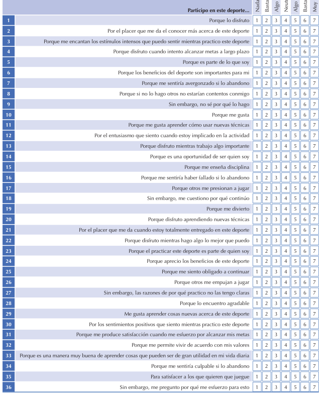
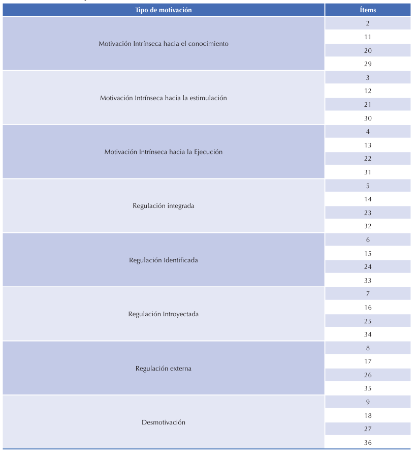
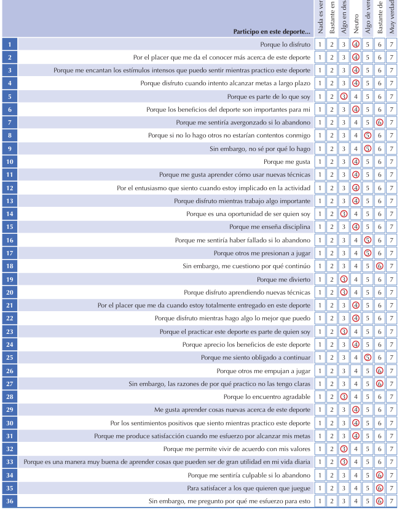
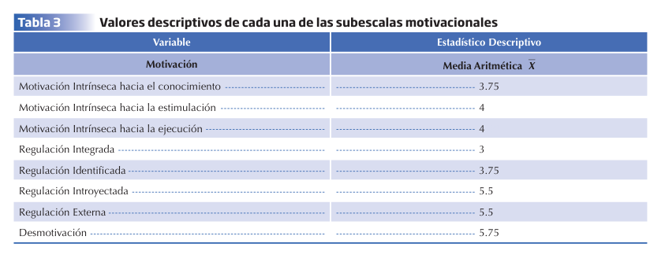
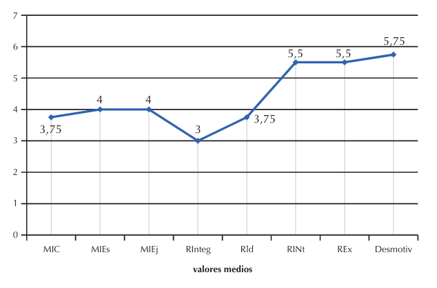
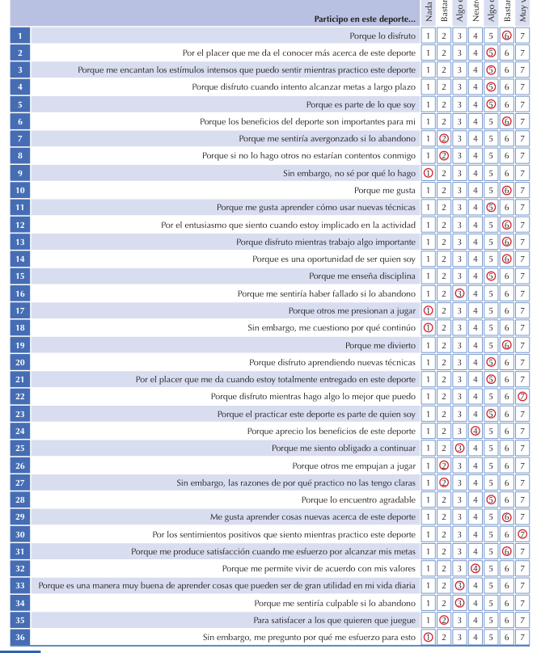
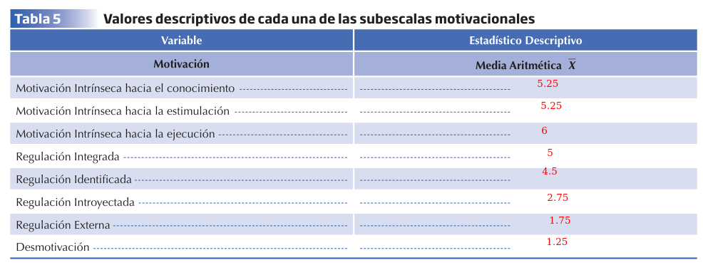
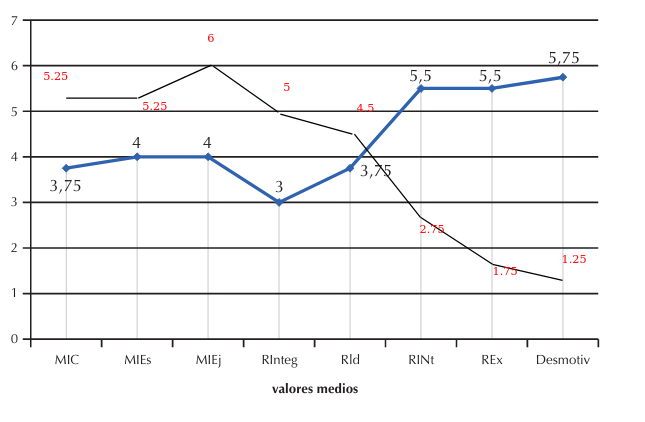

# Práctica 2 - Medición de la motivación deportiva a través de autoinformes

# Teoría

Conceptos teóricos importantes para la práctica:

- **Autodeterminación**: La tendencia innata a involucrarse en conductas que despiertan interés, en lugar de en aquellas que conllevan obligación
- **Tipos de motivación extrínseca**:
  - **Regulación externa**: La más cercana a la desmotivación. Ocurre cuando **se ejecuta una tarea sólo para evitar un castigo o recibir un premio, sin que la tarea nos interese para nada**
  - **Regulación introyectada**: **La persona ejecuta la tarea para disminuir su ansiedad y evitar culpabilidad**
  - **Regulación identificada**: Ocurre cuando la persona detecta que la actividad es importante para él/ella. **Aunque la actividad no guste, se sabe que nos puede proporcionar un beneficio externo valioso** (diferencia con la externa: aquí la persona sabe que en realidad la tarea es importante, sabe que tiene algo de valor)
  - **Regulación integrada**: El nivel más alto de conducta influida por motivación extrínseca. **Implica integrar la actividad como parte del estilo de vida. La conducta se ejecuta libremente aunque aún no por disfrute, sino por cierta instrumentalidad** (e.g. hago deporte porque sé que es bueno para mi salud)
- **Tipos de motivación intrínseca**:
  - **Hacia el conocimiento**: se hace por la satisfacción de aprender o explorar cosas nuevas
  - **Hacia la estimulación**: la actividad se hace por las sensaciones que produce (e.g. practicar alpinismo porque nos parece emocionante)
  - **Hacia la ejecución o logro**: se hace por la satisfacción de dominar algo nuevo, o masterizar una habilidad.
- **Escala de Motivación Deportiva (EMD):** un tipo de autoinforme hecho para medir la motivación por la actividad deportiva. Consiste en preguntar a los deportistas _¿por qué participas en tu deporte?_ mediante 28 preguntas de 7 categorías. Se responde en escala tipo Likert (de 1 a 7 puntos). Las categorías son:
  - Los 3 tipos de motivación intrínseca
  - 3 niveles de motivación extrínseca (todos menos integrada)
  - Desmotivación
- **Cuestionario de la Regulación Conductual en el deporte (CRCD):** un tipo de autoinforme hecho para medir la motivación por la actividad deportiva. Hay dos versiones, una de 24 preguntas y otra de 36. También es tipo Likert. Mide:
  - Motivación intrínseca (de manera general en la versión de 24, y general + 3 subtipos en la versión de 36)
  - 4 tipos de motivación extrínseca
  - Desmotivación

# Experimento

## 1a Fase - Medición de los niveles de motivación de un atleta desde la teoría de la autodeterminación

Se utiliza el cuestionario CRCD de 36 ítems

El sujeto es un varón, diestro, con visión normal, de 25 años, miembro de un club de atletismo. Participó voluntariamente porque consideraba que en las últimas pruebas sus resultados habían sido bajos.

Tras rellenar el test, estos fueron sus resultados:

Con esto, haremos tres cosas:

- Hallar las medias en los distintos tipos de motivación
- Obtener el perfil motivacional
- Calcular el índice de autodeterminación

**Autodeterminación: -5.418**

### Discusión y conclusiones

El atleta está desmotivado. Para él la motivación de la actividad es externa, no es algo que haga por disfrute personal. Esto lo confirman tanto los resultados por tipo de motivación como la puntuación del índice de autodeterminación

## 2a Fase - Entrenamiento motivacional

El objetivo de esta fase es llevar a cabo un entrenamiento para obtener motivación intrínseca y autodeterminación. Este entrenamiento duró 6 meses e incluía las siguientes estrategias:

- Se dieron consejos, no órdenes (el atleta debe cambiar por sí mismo, no lo podemos forzar)
- Se comentaron con él sus resultados, para que fuese consciente del problema
- Se trabajó su resistencia al cambio
- Se intentó elevar su percepción de autoeficacia

Actuaciones para mejorar motivación extrínseca:

- Entrenamiento en autodeterminación, dándole feedback positivo para aumentar su motivación intrínseca
- Demostrar que es posible centrarse en tareas propias y no en cómo lo hacen los demás
- Importancia de establecer objetivos de dificultad moderada
- Fomentar sentimientos de relación con entrenador y compañeros
- Sesiones encaminadas a reflexionar sobre el hecho de que la habilidad es mejorable con el esfuerzo

## 3a Fase - Medición de los niveles de motivación de un atleta desde la teoría de la autodeterminación por parte del estudiante

**Objetivo**: observar si el entrenamiento motivacional surtió efecto

El experimento se realizó 3 meses después del final del entrenamiento motivacional (es decir, 9 meses después del primer cuestionario). Se realizó al atleta el mismo cuestionario CRCD de 36 preguntas.

**Índice de autodeterminación**: 2 x 5.5 + 4.5 - 2.25 - 2 x 1.25 = 10.75

