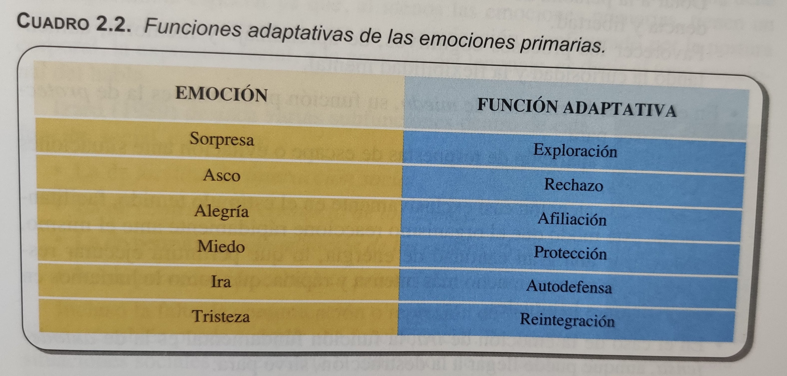
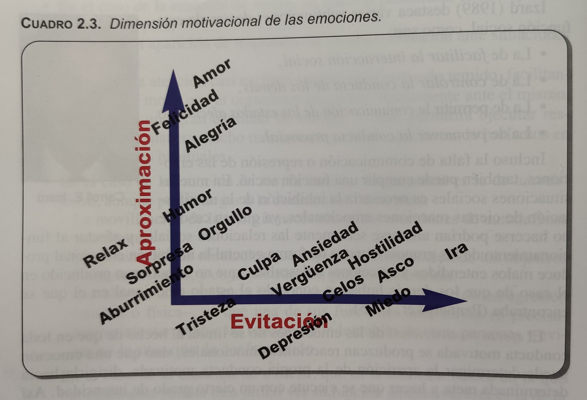
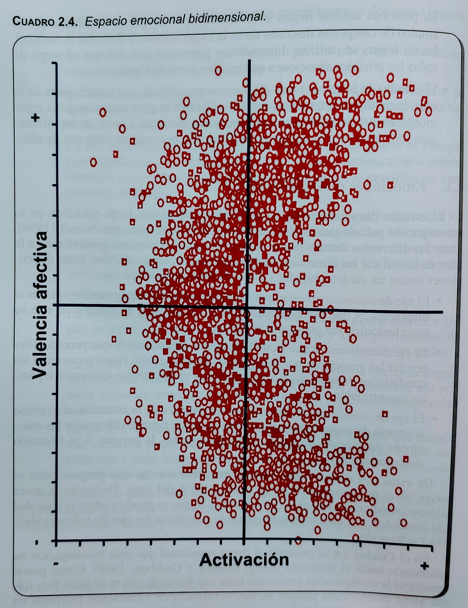
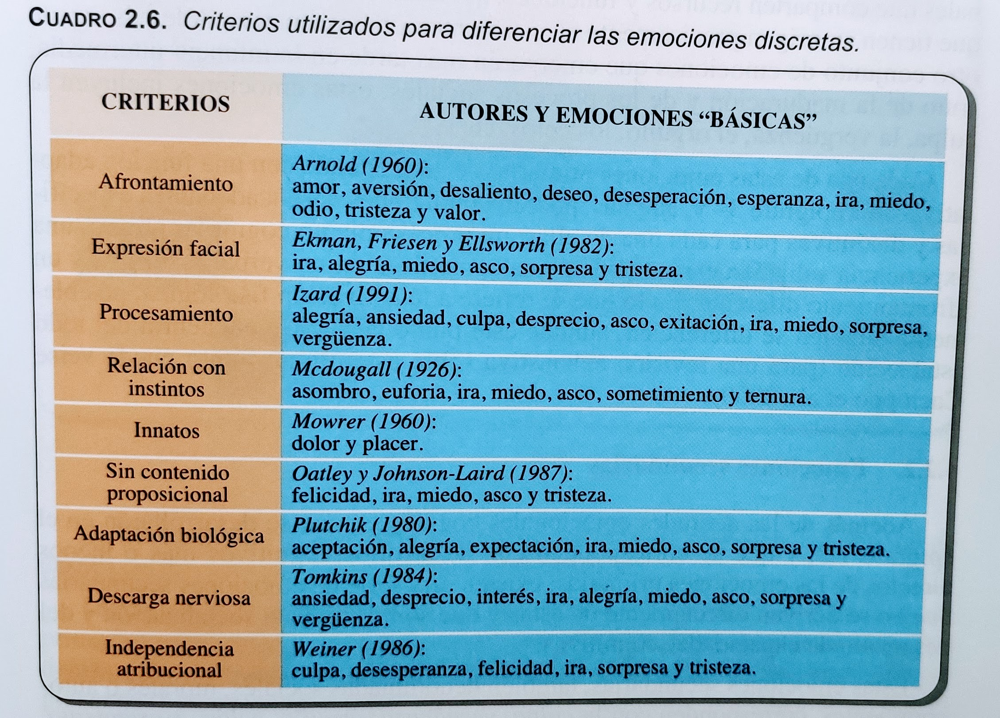
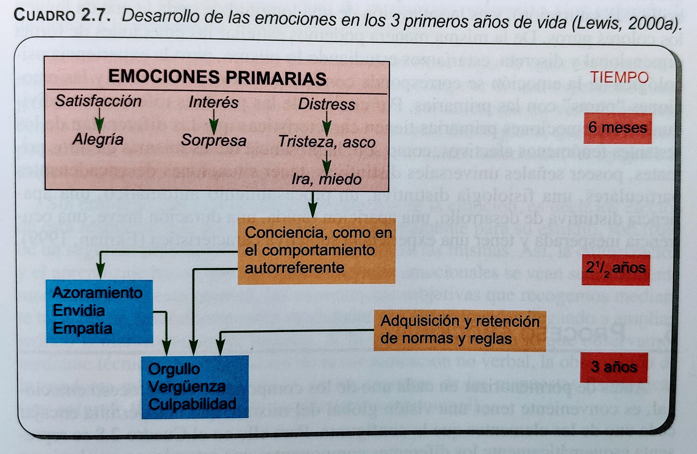
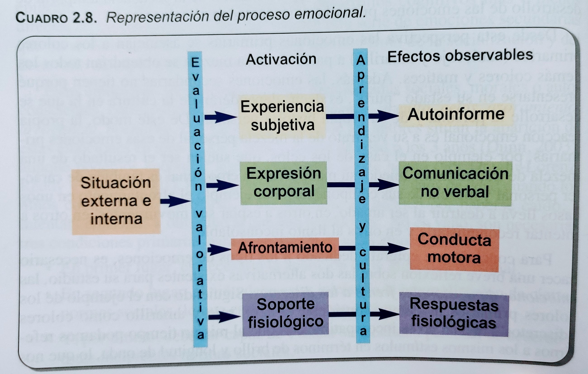
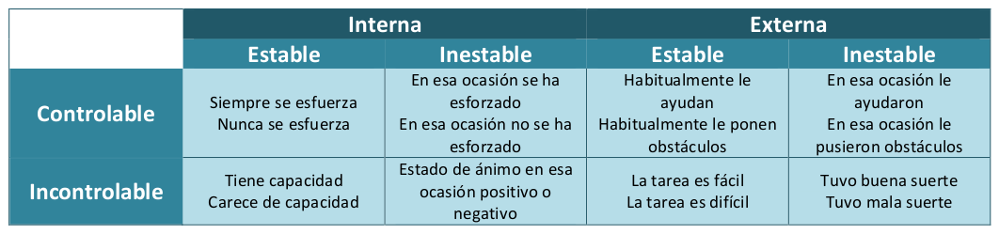
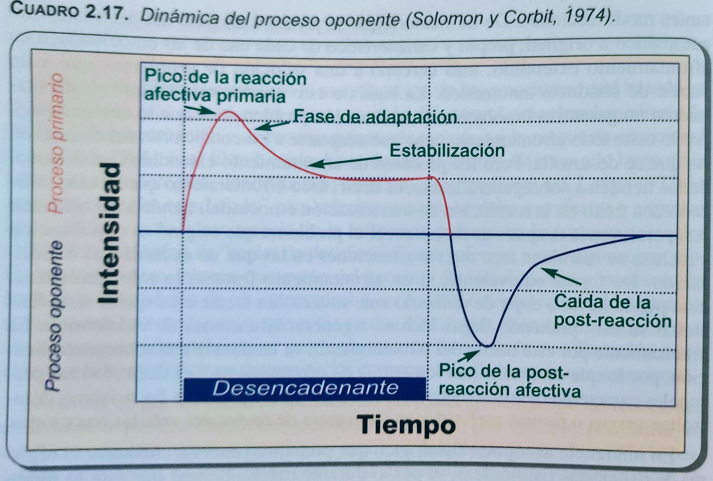
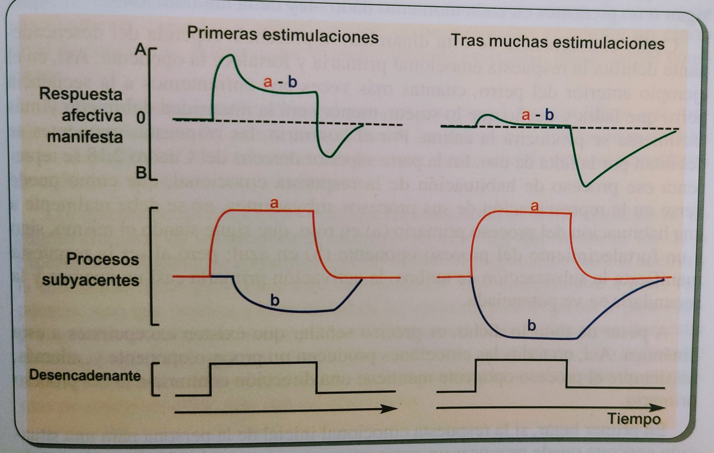

# Tema 2 - Procesamiento emocional

Table of Contents
=================

   * [Tema 2 - Procesamiento emocional](#tema-2---procesamiento-emocional)
   * [1. Introducción](#1-introducción)
   * [2. Concepto de emoción](#2-concepto-de-emoción)
   * [3. Características de las emociones](#3-características-de-las-emociones)
      * [3.1. Funciones de las emociones](#31-funciones-de-las-emociones)
      * [3.2. Tareas de las emociones](#32-tareas-de-las-emociones)
      * [3.3. Leyes de las emociones](#33-leyes-de-las-emociones)
   * [4. Tipos de emociones](#4-tipos-de-mociones)
      * [4.1. Emociones dimensionales](#41-emociones-dimensionales)
      * [4.2. Emociones discretas](#42-emociones-discretas)
   * [5. Proceso emocional](#5-proceso-emocional)
   * [6. Desencadenantes emocionales](#6-desencadenantes-emocionales)
   * [7. Evaluación y valoración emocional](#7-evaluación-y-valoración-emocional)
      * [7.1. El sistema de análisis](#71-el-sistema-de-análisis)
      * [7.2. Estilos de procesamiento](#72-estilos-de-procesamiento)
      * [7.3. Actitudes emocionales cognitivas](#73-actitudes-emocionales-cognitivas)
   * [8. Activación emocional](#8-activación-emocional)
   * [9. Manifestación emocional](#9-manifestación-emocional)
   * [10. Dinámica emocional](#10-dinámica-emocional)
   * [11. Conclusiones](#11-conclusiones)

# 1. Introducción
# 2. Concepto de emoción
Es importante diferenciar entre el concepto de "Emoción" que utilizamos en nuestro día a día, y el que utilizamos en el marco de la Psicología

**Emoción es el concepto que utiliza la Psicología para explicar los efectos producidos por un proceso encargado de:**

**- Analizar las situaciones**
**- Interpretar subjetivamente las situaciones**
**- Expresión emocional**
**- Preparación para la acción**
**- Cambios en la actividad fisiológica**

Es importante diferenciar entre:

- **Proceso emocional**: cambio puntual que se produce en un determinado momento
- **Rasgo emocional**: las formas habituales de responder emocionalmente

# 3. Características de las emociones
## 3.1. Funciones de las emociones

Tres principales, según Reeve (2004):

- **Adaptativa**: preparan al organismo para la acción
- **Social**: comunican nuestro estado de ánimo
- **Motivacional**: Facilitan las conductas motivadas

Viéndolas más en detalle:

### Adaptativa
Facilita que ocurran conductas apropiadas para la situación. Esto la ha hecho especialmente importante en la evolución de la especie.

Esta función se da especialmente en las emociones primarias:

Más en detalle, las funciones adaptativas de cada una de estas emociones son (incluidos algunos ejemplos)

- **Sorpresa** ---> **Exploración**:
  - Facilitar la reacción ante situaciones nuevas
  - Dedicar recursos emocionales, de atención y cognitivos a situaciones nuevas
- **Asco** ---> **Rechazo**
  - Evitar situaciones o cosas desagradables o dañinas
  - Potenciar hábitos saludables
- **Alegría** ---> **Afiliación**
  - Disfrutar más de la vida
  - Generar actitudes positivas hacia uno mismo y los demás
  - Favorecer las relaciones con los demás
  - Favorecer los procesos cognitivos, de aprendizaje, y memoria
- **Miedo** ---> **Protección**
  - Facilitar respuestas de escape ante situaciones peligrosas
  - Focalizar la atención en el estímulo temido
  - Movilizar una gran cantidad de energía
- **Ira** ---> **Autodefensa**
  - Movilizar mucha energía en reacciones de autodefensa o ataque
  - Eliminar obstáculos que impiden conseguir metas y generan frustración
  - Evitar confrontación (aunque suene irónico: puede ayudar a inhibir reacciones indeseables de otros, evitando así confrontación)
- **Tristeza** ---> **Reintegración**
  - Aumentar cohesión con los demás, especialmente con aquellos en nuestra misma situación
  - Reclamar la ayuda de otras personas
  - Fomenta la aparición de empatía y otros comportamientos altruistas

### Social
**Expresar emociones permite a los demás predecir nuestro comportamiento, y por tanto facilita las relaciones**. Esta expresión puede ser tanto verbal como no verbal (la no verbal es especialmente importante en las emociones primarias)

Según Izard (1989), hay varias **subfunciones dentro de la función social**:

- **Facilitar la interacción**
- **Controlar la conducta de los demás**
- **Comunicar estados afectivos**
- **Promover la conducta prosocial**

### Motivacional
**La conducta motivada produce una reacción emocional, y al mismo tiempo las emociones facilitan las conductas motivadas**. Además, las emociones juegan también un papel muy importante en la percepción y razonamiento de la situación, afectando de esta forma también a la conducta.

Las emociones dibujan dos ejes de regulación de comportamiento: aproximación y evitación

## 3.2. Tareas de las emociones
Según Stemmler (2003) todas las emociones cumplen una serie de tareas. Las más destacadas son:

- **Codificar los estímulos como positivos o negativos**
- **Interrumpir pensamientos y comportamiento, refocalizando la atención**
- **Escudriñar la memoria emocional, para localizar contingencias estímulo-respuesta aprendidas y exitosas en el pasado** (no tiene por que ser únicamente aprendidas por nosotros, puede ser también aprendidas por la especie)
- **Influenciar tendencias de respuesta hacia un tipo de motivación concreta**
- **Involucrar procesos, explícitos e implícitos, para evaluar estímulos**
- **Preparar comportamientos específicos (defensa, ataque) coordinando sistemas autonómico, somático, hormonal e inmune**
- **Comunicar a los demás nuestras intenciones** (a través de la postura, la expresión facial, etc)
- **Comunicar las actividades autonómica y somática a las aferencias para su integración en los centros cerebrales**
- **Responder con extrema rapidez a amenazas de lesiones o de integridad**

En resumen, podemos decir que **las emociones funcionan como módulos de la mente, se encargan de ajustar prioridades de procesamiento y respuesta**

## 3.3. Leyes de las emociones
También llamadas principios de las emociones. Formuladas por Frijda (1988) y reeditadas por ella también luego (2001)

Son once en total y diferenciamos dos categorías:

- **Leyes que afectan a los desencadenantes emocionales**
  - **Ley del significado situacional**: las emociones surgen en respuesta al significado de la situación
  - **Ley de lo concerniente**: las emociones surgen en respuesta a situaciones importantes para nuestras metas, deseos, motivaciones o preocupaciones (en definitiva, a situaciones que "nos conciernen")
  - **Ley de la realidad aparente**: la intensidad de nuestras emociones dependerá del grado de realidad que asimilemos en la situación (_ejemplo: en un experimento de laboratorio, la reacción será menor que si se da la misma situación en nuestro día a día_)
  - **Ley del cambio**: las emociones aparecerán cuando haya algún cambio en nuestras condiciones/situación
  - **Ley de la habituación**: los placeres o las dificultades continuadas tienden a perder fuerza
  - **Ley del sentimiento comparativo**: la intensidad de una emoción dependerá de la relación entre el evento que la desencadene y el marco de referencia que tenemos
  - **Ley de la asimetría hedónica**: el placer aparece cuando hay cambio, y desaparece cuando la situación es continua; el dolor puede persistir en el tiempo si persiste la situación
  - **Ley de conservación del momento emocional**: los momentos emocionales mantienen su capacidad para provocar emociones indefinidamente (excepto si una exposición repetida termina causando extinción o habituación)
- **Leyes que afectan a la respuesta emocional**:
  - **Ley final**: las emociones impactan la forma relativa en la que vemos una situación. _Ejemplo: nos reímos muy fuerte en el cine por algo que era gracioso y nos echan la bronca. Sentimos vergüenza. El haber expuesto la "alegría" ha hecho que la situación cambie y nos resulte vergonzosa_
  - **Ley del _cuidado con las consecuencias_**: cada impulso emocional provoca un segundo impulso que intenta modificar ese impulso de acuerdo con sus posibles consecuencias
  - **Ley de la menor carga y el mayor beneficio**: cuando una situación puede verse desde distintas perspectivas, tenemos tendencia a verla desde aquella que minimice la carga emocional negativa o maximice la ganancia emocional

# 4. Tipos de emociones

Hay dos enfoques de clasificación mayoritarios

- **Estudio dimensional**: se fundamenta en que hay importantes diferencias individuales en las emociones que las personas adultas desarrollamos, y por tanto se utilizan dimensiones que permiten representar las emociones cuantitativamente y de forma individual.
- **Estudio discreto**: se basa en que cada categoría de emociones tiene características únicas y distintivas, lo que permite hablar de ellas de manera grupal a pesar de que haya diferencias individuales.

## 4.1. Emociones dimensionales
Este tipo de estudio se defendió inicialmente por Wundt (1896). Actualmente hay un consenso bastante generalizado a la hora de determinar las dimensiones relevantes.

Se definen tres dimensiones:

- **Valencia afectiva - De agradable a desagradable**: permite diferenciar las emociones en función de si nos aportan placer o dolor/sufrimiento.
- **Activación - De calma a entusiasmo**: diferencia las emociones en función de la intensidad de los cambios fisiológicos que desatan.
- **Control - De controlador a controlado**: diferencia según quién ejerza el dominio, si la persona o la situación.

**La valencia afectiva y la activación son las más importantes, permiten diferenciar al 85% de las emociones**. Por ello, habitualmente se utilizan solo estos dos ejes.

Representar las emociones en estas dos dimensiones resulta en un gráfico con forma de cuarto de luna. Esto ocurre porque **no hay situaciones extremas en valencia afectiva que sean bajas en activación, ni situaciones de activación extrema que sean neutras en valencia afectiva**.

Se han visto también dos diferencias importantes entre emociones negativas y positivas:

- **Duración**: las emociones negativas duran más que las positivas (110 mins vs 40 mins de media). Esto se puede explicar porque, con emociones negativas, tenemos que preparar planes que alivien la situación (esta conclusión concuerda con la _Ley de la asimetría hedónica de Frijda_)

## 4.2. Emociones discretas
El fundamento de esta corriente de estudio se basa en que algunas emociones tienen unas características concretas y distintivas.

Existen muchas clasificaciones distintas, pero la más clave separa las emociones en **primarias y secundarias**.

### 4.2.1. Emociones primarias
**Se trata de emociones que surgen desde el principio de la vida, de forma natural. Son fruto de cambios filogenéticos + ontogenéticos a lo largo de la historia de nuestra especie**.

Algunos ejemplos de emociones primarias son: **alegría, sorpresa, asco, miedo, tristeza, ira**

Algunas características de las emociones primarias:

- **Cada una está asociada a una función adaptativa**
- **Poseen desencadenantes específicos y distintivos**
- **Cada una tiene características únicas (que la diferencian de las demás)** en:
  - Experiencia subjetiva
  - Procesamiento cognitivo
  - Comunicación no verbal
  - Afrontamiento

Podrían presentar también diferencias en cuanto a activación fisiológica, pero esto aún no está confirmado (para una revisión exhaustiva de esto, ver _Cacioppo et al, 2000_)

### 4.2.2. Emociones secundarias
**Emociones que no surgen directamente de las primarias, y que son fruto de la socialización y el desarrollo cognitivo**. 

Algunos ejemplos: **culpa, vergüenza, celos, orgullo, arrogancia**.

Tienen que darse tres condiciones para que aparezcan estas emociones:

- **Existe identidad personal**
- **Se han internalizado ciertas normas sociales** (o se empieza a hacerlo)
- **Se puede evaluar la identidad personal de acuerdo a estas normas sociales**

Por todo esto, se sitúa la aparición de estas emociones en torno a los 2.5 - 3 años (cuando ya se dan estas condiciones).

### 4.2.3. Reflexión final
Una forma de entender la dualidad _estudio dimensional vs estudio discreto_ es pensar en las emociones como colores: podemos entender las emociones como los colores primarios: rojo, azul, amarillo (colores _discretos_). Pero al mismo tiempo, esto no quiere decir que sea incompatible con referirse a ellos por su longitud de onda (magnitud continua, colores _dimensionales_)

De la misma forma, el hecho de que nos refiramos a las emociones de manera discreta (sorpresa, ira, miedo, etc) no quiere decir que descartemos la idea de que en realidad se encuentran en un continuo (estudio dimensional).

# 5. Proceso emocional

El proceso emocional se puede entender en distintas fases:

1) **Percepción de los cambios en nuestro contexto** (externo o interno)
2) **Procesado de esos cambios: evaluación valorativa**
3) **Reacción al cambio: activación**. Se producen cambios en nosotros como respuesta al cambio en el contexto: **sentimiento, expresión corporal, tendencia a la acción y cambios fisiológicos**
4) **Filtrado en función del aprendizaje y la cultura**: personas distintas reaccionan de forma distinta a la misma activación, dependiendo de la cultura o de lo que nos hayan enseñado.
5) **Efectos observables**: la representación final de la emoción, tras pasar por el filtrado: **autoinforme, comunicación no verbal, conducta desencadenada, respuesta fisiológica**

La parte importante a considerar es que, aunque 3) y 5) sean similares, no son exactamente lo mismo: uno es el efecto que produce la emoción, y otro es cómo reaccionamos a ese efecto.

# 6. Desencadenantes emocionales
Como ya hemos mencionado, **lo que desencadena el cambio emocional es nuestra percepción de que ha habido un cambio en el ambiente**. Puede ser un cambio externo (percibido por los sentidos: vista, gusto, oído...) o un cambio interno (pensar algo, recordar algo)

Además, es importante que **el cambio capte nuestra atención, aunque sea de forma automática e inconsciente**. Si no, no va a haber reacción (lo cual puede ocurrir por ejemplo si ha habido mucha exposición a ese mismo cambio, recordar la _Ley de la habituación_ de Frijda)

También es importante que **la situación sea creíble, verosímil: cuanto más real la percibamos, mayor va a ser la respuesta emocional** (recordemos la _Ley de la realidad aparente_: un experimento en un laboratorio va a desencadenar menos emoción que la misma situación en nuestro día a día)

Por último, **el desencadenante no tiene por qué ser un estímulo concreto, puede ser un conjunto de estímulos que se dan al mismo tiempo**. Incluso si no hubiésemos reaccionado a ellos de forma individual, el que aparezcan en conjunto puede aumentar su capacidad desencadenante

# 7. Evaluación y valoración emocional
Ha habido dos posturas principales respecto a cómo valoramos las emociones. **En la actualidad, se considera que ambas actúan en conjunto: dualidad del análisis**.

- **Primacía del afecto**: modelos más evolucionistas, actuamos por instintos aprendidos
- **Primacía de la cognición**: modelos con mayor influencia social-cognitiva

(_Sistema de análisis se define en 7.1, ayuda a entender esto mejor_)

Todas las propuestas comparten unos puntos comunes:

- **Cada respuesta emocional es activada por un tipo distinto de análisis**: incluso las mismas valoraciones, pero combinadas distinto, activan distintas emociones
- **Diferencias en análisis + diferencias individuales/temporales = resultado**: ambos factores se combinan en el momento de definir con qué emoción responderemos
- **Todas las situaciones con la misma valoración, despiertan la misma emoción**
- **Sistema de análisis = procesamiento de la información**: el análisis va a predecir qué respuestas emocionales nos darán mayor ventaja ante una situación concreta
- **Los sistemas de análisis explican también respuestas incorrectas**: ocurren como resultado de una valoración no ajustada a la realidad (e.g. "malinterpretar" algo)
- **Cambios en el sistema de análisis de un niño marcan su futuro**

## 7.1. El sistema de análisis

**Sistema de análisis**: el primer filtro en el procesamiento de las emociones, discrimina la información que tiene relevancia emocional de la que no. Además, le da un grado de intensidad.

Scherer es el mayor exponente de todo esto (1984, 1988, 1990).

El sistema juega un doble papel:

- **Evaluación**: extrae la información de la situación
- **Valoración**: identifica cómo nos afecta la situación a nosotros personalmente

### 7.1.1. La evaluación de la situación

Dos componentes principales:

- **Novedad**: se analiza si la situación es habitual, o si es nueva/improbable. Somos más propensos a reaccionar ante situaciones nuevas, imprevistas (incluyendo la ausencia de un cambio previsto)
- **Agrado intrínseco**: se analiza si la situación es agradable o no. Si es agradable, tendemos al acercamiento. Si es desagradable, a la evitación/huida. Los criterios parecen más innatos que adquiridos.
  - Es importante no confundir el agrado **intrínseco** con la valoración, el significado personal para nosotros

**La evaluación se realiza principalmente con procesos automáticos y bajo nivel de conciencia. Vía de análisis rápida, que implica pocos recursos, y que permite dar una respuesta de urgencia**. Esto lo convierte en un sistema impreciso y muy vulnerable a estereotipos, pero es mejor un sistema que responda a todo muy rápido (aunque dé falsas alarmas) que otro que intente ser más preciso pero se le escapen situaciones.

### 7.1.2. Valoración de la situación

Varios componentes:

#### 1) Significación
**Significación: si la situación es relevante para nosotros mismos, aquí y ahora** (_ley del significado situacional_).

Utilizamos tres niveles de análisis para determinar esta relevancia:

- **Primer nivel: molecular**: hace la valoración individual de cada componente de la situación. Dos partes:
  - **Relevancia**: si la situación nos importa
  - **Congruencia**: si la situación que ha ocurrido es la que queremos. Si sí, respuesta positiva (alegría, alivio). Si no, respuesta negativa (ira, miedo)
- **Segundo nivel: molar**: agrupa los juicios que pueden despertar una misma emoción y los agrupa, haciendo un "resumen". Varios componentes:
  - **Responsabilidad**: quién ha causado la situación, hacia quién irá dirigida nuestra emoción. Podemos ser nosotros mismos u otros, y ocurre tanto con situaciones congruentes ("gracias a quién") como incongruentes ("de quién es la culpa")
  - **Potencial de afrontamiento enfocado al problema**: habilidad que creemos que tenemos para enfrentarnos a la situación/problema, mirar si podemos solucionarlo
  - **Potencial de afrontamiento enfocado a la culpa**: percepción de si podemos modificar cómo nos afecta la situación/problema, mirar si podemos tomárnoslo de otra forma
  - **Expectativas futuras**: posibilidades de cambiar la situación (actual o psicológica), que podrían hacer que la situación sea más/menos congruente motivacionalmente
- **Tercer nivel: individual**: incluye los componentes de la valoración propios de cada individuo. Es el nivel que explica que una persona sea más propensa a reaccionar de una forma que de otra

#### 2) Afrontamiento
**Afrontamiento: nos enfrentamos a la situación y a su causa** _(para entenderlo mejor, "afrontamiento" en inglés es "coping", es decir que se refiere a cómo gestionamos/nos tomamos la situación, "how do we cope with the situation")_

Hay varias partes que influyen en esto (Scherer, 1988)

- **Control**: si podemos influenciar que la situación ocurra (directamente o con ayuda de otros), o si ocurre por cosas fuera de nuestro control
- **Poder**: si la situación ocurre, si somos capaces de controlarla con éxito
- **Ajuste**: si podemos adaptarnos a la situación. Especialmente importante si control+poder sugieren que no podemos cambiar el resultado

**La función principal es determinar la respuesta apropiada para un acontecimiento, dada su naturaleza y nuestros recursos**

Es muy relevante la **Teoría de la atribución emocional de Weiner** (1985). **La emoción que se genera depende de tres dimensiones**:

- **Interna - externa**: ¿La situación la hemos causado nosotros, o ha ocurrido de por sí?
- **Controlable - Incontrolable**: ¿Podemos conseguir lo mismo en el futuro (solos o con ayuda de otros), o depende del azar?
- **Estable - inestable**: ¿La causa del resultado/situación es duradera, o temporal?

Es muy importante **la dimensión de agente, el responsable de la situación**, que surge de todas estas. Nos permite distinguir, por ejemplo entre _ira_ (el agente es otro), _culpabilidad_ (el agente somos nosotros) y _tristeza_ (el agente son las circunstancias). 

#### 3) Las normas
**Normas: se utilizan para analizar si la acción que vamos a realizar es conforme con lo social o culturalmente aceptado**

Valoramos nuestro comportamiento en dos ámbitos:

- **Moral**: si el comportamiento es aceptable dentro del grupo de referencia que tomamos (importante lo de "grupo de referencia": la moralidad no es la misma en todas partes)
- **Interior**: si el comportamiento es aceptable dentro de la idea que tenemos de nosotros mismos (autoconcepto)

Si hay discrepancia entre estos dos ámbitos, habrá disonancias: juzgaremos con desprecio a los demás (si creemos que nuestas normas internas no concuerdan con las normas sociales) o nos sentiremos culpables (si nuestro comportamiento concuerda con la norma social, pero no con nuestro autoconcepto)

**RESUMEN DE LA SECCIÓN**

## 7.2. Estilos de procesamiento

Existen cuatro estilos principales de procesamiento emocional (Forgas, 1993)

- **Estilo de acceso directo**: el más sencillo. Recupera valoraciones/reacciones anteriores.
- **Estilo motivado**: favorece emociones que nos ayuden a alcanzar metas
- **Estilo heurístico**: intenta llegar a una valoración emocional con el menor esfuerzo posible
- **Estilo sustancial**: mantiene continuamente el procesamiento y la interpretación

Además, existen dos rangos de personalidad que afectan al procesamiento en las personas que los tienen:

- **Personas represoras**: intentan retirar la atención de estímulos amenazantes (se relaciona con mayor ansiedad)
- **Personas sensibles**: continuamente supervisan el entorno (se relaciona con mayor deseabilidad social)

No hay evidencia actualmente de que el resto de rangos de personalidad influencien el procesamiento emocional (Rusting, 1998)

## 7.3. Actitudes emocionales cognitivas
**Actitudes emocionales: predisposición a actuar de cierta manera ante un estímulo**. Dos mecanismos principales:

- **Hipervigilancia**: estamos muy atentos a los cambios en el ambiente
- **Reducción de umbral**: mediante **atención selectiva** (nos fijamos más en los estímulos relacionados con esa actitud) y **amplificación** (aumentamos los estímulos relacionados con esa actitud)

Al mismo tiempo, las actitudes emocionales provocan tres tipos de sesgos:

- **Sesgos de aprendizaje**: retenemos mejor la información de los estímulos relacionados con la emoción
- **Sesgos de activación de memoria**: recordamos más la información relacionada con la emoción
- **Sesgos de interpretativos**: ante una situación ambigua, tendemos a darle un significado emocional relacionado con la emoción (aunque la situación hubiese tenido significado neutro si no tuviésemos esa actitud)

Una actitud emocional cognitiva es lo que denominamos un tipo de **procesamiento top-down: primero interpretamos nuestros pensamientos, y luego interpretamos el estímulo ya con cierta predisposición** (en lugar de al revés, primero analizar bien el estímulo y luego ya lo interpretamos)

Resumen: **las actitudes emocionales cognitivas son fruto de una serie de sesgos que actúan sobre el sistema de valoración de la situación, preparando los recursos psicológicos para un tipo de reacción específica**

# 8. Activación emocional
La activación emocional es depende de varios factores e implica múltiples efectos. Los más clave son:
#### 1) Experiencia subjetiva 

**Experiencia subjetiva: las sensaciones o sentimientos que produce la respuesta emocional** (es decir, podríamos decir que es sinónimo se sentimiento)

Según Cabanac, 2002, la experiencia emocional depende de cuatro factores:

- **Duración temporal**
- **Cualidad emocional**
- **Intensidad de la situación**
- **Grado de placer-displacer**

(Cabanac lo representa como `s = f(x[t], y[t], z[t])` - Es decir, en realidad el sentimiento depende de cualidad + intensidad + placer-displacer, y estos dependen del tiempo)

Al mismo tiempo, el **el sentimiento está muy relacionado con cambios en la bioquímica del organismo, especialmente las expresiones faciales**. Existen dos conexiones entre expresiones faciales y estructuras cerebrales:

- **Transmitir impulsos cerebrales a los músculos de la cara para formar expresiones**
- **Transmitir las expresiones de la cara al cerebro para entender mejor las emociones**

Es decir, existe un sistema de **feedback facial**: nuestras emociones afectan a la expresión, y la expresión afecta a cómo procesamos nuestras emociones (si sonreímos más, veremos las cosas de mejor manera)

#### 2) La expresión corporal
**Expresión corporal: la exteriorización de las emociones mediante comunicación no verbal**

Las formas más características son:

- **Expresión facial**
- **Prosodia (tono emocional del habla)**

Ambas se ven muy claras con las emociones primarias:

- Tristeza --> ángulos de los ojos hacia abajo, comisuras de los labios hacia abajo --- tono medio más bajo, velocidad de hablar lenta
- Asco --> cejas juntas, nariz fruncida, barbilla elevada --- tono medio bajo, velocidad de hablar lenta, con más pausas
- Ira --> cejas bajas y contraídas, mirada prominente --- tono medio más alto, velocidad más rápida
#### 3) El afrontamiento
**Afrontamiento: los cambios de comportamiento que producen las emociones, y que nos preparan para la acción** _(para entenderlo mejor, "afrontamiento" en inglés es "coping", es decir que se refiere a cómo gestionamos/nos tomamos la situación, "how do we cope with the situation")_

**Es un proceso psicológico que se pone en marcha cuando en el entorno se producen cambios no deseados no estresantes, o cuando las consecuencias de los cambios no son las que deseábamos**

Esto se ve muy claro en las emociones primarias, que tienen afrontamientos muy característicos. Ejemplos:

- Miedo --> Huida
- Ira --> Agresión
- Sorpresa --> Vigilancia
- Alegría --> Disfrute, acercamiento

#### 4) El soporte fisiológico
**Soporte fisiológico: los cambios que se producen en el Sistema Nervioso Central (SNC), en el Sistema Nervioso Periférico (SNP) y en el sistema Endocrino**. Los más estudiados son los cambios que afectan al Sistema Nervioso Autónomo (SNA) y al sistema Nervioso Somático (SNS)

_Algunos_ ejemplos de estos cambios (hay muchísimos más, incluso en estas emociones)

- Miedo --> Incremento de la frecuencia cardíaca (SNA), aumento de la tensión muscular o de la frecuencia respiratoria (SNS)
- Tristeza --> Aumento moderado de la frecuencia cardíaca (SNA), aumento de la amplitud de la respiración pero no de su frecuencia (SNS)
- Ira --> Aumento de la frecuencia cardíaca, aunque menor que en el miedo (SNA), aumento de la tensión muscular y de la frecuencia respiratoria (SNS)

# 9. Manifestación emocional
**Manifestación emocional: el filtro que controla cómo mostramos las emociones. Se basa principalmente en el aprendizaje, la cultura y valores sociales**

Incluye un autocontrol y control externo sobre cómo pueden manifestarse las emociones, y actúa en dos direcciones:

- Controlando ciertos efectos para expresar más nuestra emoción
- Eliminando algunos componentes de la respuesta emocional (e.g. si sabemos que están mal vistos)

# 10. Dinámica emocional

**Dinámica emocional: cómo evoluciona nuestra emoción en el tiempo**

Dos fases principales:

- **Proceso emocional primario**: Ocurre justo al principio, cuando empezamos a mostrar la emoción. Aparece de forma inmediata, y es cuando más intensa es la emoción. Tras un breve pico inicial, la intensidad disminuye y se establiza.
- **Proceso oponente**: Una respuesta emocional contraria a la inicial. Juega un papel homeostático, para que volvamos al estado de equilibrio. Es más largo que el proceso emocional primario, y se va más progresivamente

Algo que ocurre también es que, cuando hayamos pasado por la misma situación muchas veces, nos acostumbraremos al estímulo y reaccionaremos menos a él (recordemos la _Ley de la habituación_ de Frijda). Esto ocurre porque el proceso oponente se vuelve más fuerte, y por tanto contrarresta más al proceso primario, con lo que se queda una respuesta neutra

Existen algunas excepciones en las que el proceso emocional primario no produce un proceso oponente:

- Si la respuesta emocional provoca un nuevo estímulo que cambia la situación (_Ley del Cuidado con las consecuencias_)
- Si la respuesta emocional se convierte en parte de la situación, podemos pasar a valorarla también, y que con esto se generen nuevas emociones (si nos enfadamos mucho con alguien, y luego nos damos cuenta de que nos hemos pasado, aparece una nueva sensación de vergüenza por nuestra reacción exagerada)

# 11. Conclusiones
Detalles importantes a tener en cuenta del capítulo

- El proceso emocional es:
  - Un sistema de procesamiento de información, que procesa información vital (la que desencadenará nuestras emociones)
  - Un sistema de reacción frente a las demandas del entorno
  - Un sistema de proacción para actuar cuando detectamos que vamos a tener una necesidad emocional (antes de que aparezca)

- Diferencia enre experiencia emocional y proceso emocional:
  - **Experiencia emocional**: el sentimiento
  - **Proceso emocional**: _(ver arriba_). Lo que causa el sentimiento.

- Las emociones tienen múltiples efectos (_activación emocional_):
  - Experiencia subjetiva
  - Comunicación no verbal
  - Preparación para la acción (afrontamiento)
  - Activación fisiológica
